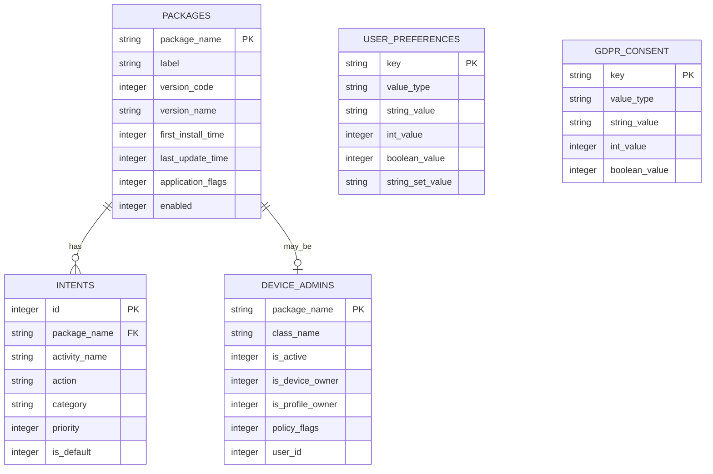

# Aplin データベース設計（逆生成）

## 分析日時
2025-08-02T09:30:00Z

## データストレージ概要

AplinはAndroidアプリケーションとして、従来のリレーショナルデータベースは使用せず、Android SDKが提供するデータストレージメカニズムを活用しています。主要なデータソースとストレージ方式を以下に分析します。

## データソース分析

### 1. Android System Package Database (読み取り専用)
Androidシステムが管理するパッケージ情報データベースへの読み取りアクセス

**アクセス方法**: `PackageManager` API経由
**権限**: `QUERY_ALL_PACKAGES`
**データ形式**: Android内部SQLiteデータベース（直接アクセス不可）

#### 仮想テーブル: packages（PackageManager API抽象化）
```sql
-- システム内部的な構造（直接アクセス不可）
CREATE TABLE packages (
    package_name TEXT PRIMARY KEY,           -- パッケージ名
    label TEXT,                             -- アプリ表示名
    version_code INTEGER,                   -- バージョンコード
    version_name TEXT,                      -- バージョン名
    first_install_time INTEGER,            -- 初回インストール時刻（Unix timestamp）
    last_update_time INTEGER,              -- 最終更新時刻（Unix timestamp）
    application_flags INTEGER,             -- アプリケーションフラグ（システムアプリ判定等）
    enabled INTEGER,                        -- 有効状態（0: 無効, 1: 有効）
    icon_resource_id INTEGER,              -- アイコンリソースID
    target_sdk_version INTEGER,            -- 対象SDKバージョン
    min_sdk_version INTEGER,               -- 最小SDKバージョン
    install_location INTEGER,              -- インストール場所
    uid INTEGER,                           -- ユーザーID
    shared_user_id TEXT,                   -- 共有ユーザーID
    data_dir TEXT,                         -- データディレクトリ
    native_library_dir TEXT,              -- ネイティブライブラリディレクトリ
    source_dir TEXT,                       -- APKファイルパス
    public_source_dir TEXT,                -- 公開APKファイルパス
    class_name TEXT,                       -- メインActivityクラス名
    process_name TEXT,                     -- プロセス名
    theme INTEGER,                         -- テーマリソースID
    manages_space INTEGER,                 -- ストレージ管理フラグ
    category INTEGER                       -- アプリカテゴリ
);

-- インデックス（システム管理）
CREATE INDEX idx_packages_enabled ON packages(enabled);
CREATE INDEX idx_packages_flags ON packages(application_flags);
CREATE INDEX idx_packages_install_time ON packages(first_install_time);
CREATE INDEX idx_packages_update_time ON packages(last_update_time);
```

#### 仮想テーブル: intents（Intent Filter情報）
```sql
-- ホームランチャー検出用
CREATE TABLE intents (
    id INTEGER PRIMARY KEY AUTOINCREMENT,
    package_name TEXT,                      -- パッケージ名
    activity_name TEXT,                     -- Activityクラス名
    action TEXT,                           -- Intent Action
    category TEXT,                         -- Intent Category
    priority INTEGER,                      -- 優先度
    is_default INTEGER,                    -- デフォルトフラグ
    FOREIGN KEY (package_name) REFERENCES packages(package_name)
);

-- ホームランチャー抽出クエリ相当
-- SELECT DISTINCT package_name FROM intents 
-- WHERE action = 'android.intent.action.MAIN' 
--   AND category = 'android.intent.category.HOME';
```

### 2. Device Policy Database (読み取り専用)
デバイス管理情報への読み取りアクセス

**アクセス方法**: `DevicePolicyManager` API経由
**権限**: 標準権限（DEVICE_ADMIN関連は設定アプリで必要）

#### 仮想テーブル: device_admins
```sql
CREATE TABLE device_admins (
    package_name TEXT PRIMARY KEY,          -- 管理者アプリパッケージ名
    class_name TEXT,                        -- DeviceAdminReceiverクラス名
    is_active INTEGER,                      -- アクティブ状態
    is_device_owner INTEGER,                -- デバイスオーナーフラグ
    is_profile_owner INTEGER,               -- プロファイルオーナーフラグ
    policy_flags INTEGER,                   -- ポリシーフラグ
    user_id INTEGER                         -- ユーザーID（マルチユーザー対応）
);
```

### 3. User Preferences (DataStore) - 読み書き可能
ユーザー設定の永続化ストレージ

**実装**: Jetpack DataStore Preferences
**ファイル場所**: `/data/data/com.nagopy.android.aplin/files/datastore/settings.preferences_pb`
**データ形式**: Protocol Buffers

#### preferences テーブル相当
```sql
-- DataStore内部構造（Protocol Buffers形式）
CREATE TABLE preferences (
    key TEXT PRIMARY KEY,                   -- 設定キー
    value_type TEXT,                       -- 値タイプ（STRING, INT, BOOLEAN等）
    string_value TEXT,                     -- 文字列値
    int_value INTEGER,                     -- 整数値
    boolean_value INTEGER,                 -- ブール値
    string_set_value TEXT,                 -- 文字列セット値（JSON配列形式）
    created_at INTEGER,                    -- 作成時刻
    updated_at INTEGER                     -- 更新時刻
);

-- 実際の設定データ
INSERT INTO preferences VALUES 
('sort_order', 'STRING', 'LABEL', NULL, NULL, NULL, 1672531200, 1672531200),
('display_items', 'STRING_SET', NULL, NULL, NULL, '["INSTALL_TIME","UPDATE_TIME"]', 1672531200, 1672531200);
```

#### 設定データ詳細定義
```kotlin
// SortOrder設定
enum class SortOrder {
    LABEL,              // "LABEL"
    PACKAGE_NAME,       // "PACKAGE_NAME" 
    FIRST_INSTALL_TIME, // "FIRST_INSTALL_TIME"
    LAST_UPDATE_TIME    // "LAST_UPDATE_TIME"
}

// DisplayItem設定
enum class DisplayItem {
    INSTALL_TIME,       // "INSTALL_TIME"
    UPDATE_TIME,        // "UPDATE_TIME"
    VERSION            // "VERSION"
}
```

### 4. GDPR Consent Storage (SharedPreferences) - 読み書き可能
GDPR同意情報の永続化

**実装**: Android SharedPreferences
**ファイル場所**: `/data/data/com.nagopy.android.aplin/shared_prefs/[name].xml`

#### consent_preferences テーブル相当
```sql
CREATE TABLE consent_preferences (
    key TEXT PRIMARY KEY,                  -- 設定キー
    value_type TEXT,                      -- 値タイプ
    string_value TEXT,                    -- 文字列値
    int_value INTEGER,                    -- 整数値
    boolean_value INTEGER                 -- ブール値
);

-- GDPR/TCF関連設定
INSERT INTO consent_preferences VALUES
('IABTCF_gdprApplies', 'INT', NULL, 1, NULL),                    -- GDPR適用フラグ
('IABTCF_PurposeConsents', 'STRING', '1010101000', NULL, NULL),  -- 目的同意文字列
('IABTCF_VendorConsents', 'STRING', '001101...', NULL, NULL),    -- ベンダー同意文字列
('IABTCF_VendorLegitimateInterests', 'STRING', '000110...', NULL, NULL), -- ベンダー正当利益
('IABTCF_PurposeLegitimateInterests', 'STRING', '0110001000', NULL, NULL); -- 目的正当利益
```

## データアクセスパターン

### 1. パッケージ情報読み込みパターン

```kotlin
// Repository層でのデータアクセス
class PackageRepositoryImpl : PackageRepository {
    
    // 全パッケージ読み込み
    override suspend fun loadAll(): List<PackageInfo> {
        return withContext(ioDispatcher) {
            packageManager.getInstalledPackages(PackageManager.GET_META_DATA)
        }
    }
    
    // ホームパッケージ読み込み  
    override suspend fun loadHomePackageNames(): Set<String> {
        return withContext(ioDispatcher) {
            val homeIntent = Intent(Intent.ACTION_MAIN)
                .addCategory(Intent.CATEGORY_HOME)
            packageManager.queryIntentActivities(homeIntent, PackageManager.MATCH_DEFAULT_ONLY)
                .map { it.activityInfo.packageName }
                .toSet()
        }
    }
}
```

### 2. 設定データアクセスパターン

```kotlin
// DataStore Pattern
class UserDataStore(private val dataStore: DataStore<Preferences>) {
    
    private val sortOrderKey = stringPreferencesKey("sort_order")
    private val displayItemsKey = stringSetPreferencesKey("display_items")
    
    // 読み込み（Flow）
    val sortOrder: Flow<SortOrder> = dataStore.data.map { preferences ->
        val orderName = preferences[sortOrderKey] ?: SortOrder.DEFAULT.name
        SortOrder.values().find { it.name == orderName } ?: SortOrder.DEFAULT
    }
    
    // 書き込み（suspend function）
    suspend fun updateSortOrder(sortOrder: SortOrder) {
        dataStore.edit { preferences ->
            preferences[sortOrderKey] = sortOrder.name
        }
    }
}
```

### 3. GDPR同意データアクセスパターン

```kotlin
// SharedPreferences Pattern
class AdsViewModel(private val prefs: SharedPreferences) {
    
    // GDPR判定
    private fun isGDPR(): Boolean {
        return prefs.getInt("IABTCF_gdprApplies", 0) == 1
    }
    
    // 同意状態チェック
    private fun canShowAds(): Boolean {
        val purposeConsent = prefs.getString("IABTCF_PurposeConsents", "") ?: ""
        val vendorConsent = prefs.getString("IABTCF_VendorConsents", "") ?: ""
        // IAB TCF v2仕様に基づく判定ロジック
        return hasConsentFor(listOf(1), purposeConsent, hasGoogleVendorConsent)
    }
}
```

## データ関係性・制約

### 関係性ダイアグラム



### ビジネスルール・制約

#### パッケージ分類制約
```sql
-- システムアプリ判定
-- application_flags & FLAG_SYSTEM != 0

-- 無効化可能アプリ制約
-- 1. システムアプリであること
-- 2. 有効状態であること  
-- 3. ホームランチャーでないこと
-- 4. デバイス管理者でないこと
-- 5. システム保護アプリでないこと

SELECT p.package_name 
FROM packages p
LEFT JOIN intents i ON p.package_name = i.package_name 
    AND i.action = 'android.intent.action.MAIN'
    AND i.category = 'android.intent.category.HOME'
LEFT JOIN device_admins da ON p.package_name = da.package_name
WHERE (p.application_flags & 1) != 0  -- FLAG_SYSTEM
  AND p.enabled = 1
  AND i.package_name IS NULL          -- ホームランチャーでない
  AND da.package_name IS NULL         -- デバイス管理者でない
  AND p.package_name NOT IN (
    'android',
    'com.android.systemui',
    'com.android.settings'
  );
```

#### ソート制約
```kotlin
// SortOrder実装制約
when (sortOrder) {
    LABEL -> compareBy<PackageModel> { it.label }.thenBy { it.packageName }
    PACKAGE_NAME -> compareBy<PackageModel> { it.packageName }.thenBy { it.label }
    FIRST_INSTALL_TIME -> compareByDescending<PackageModel> { it.firstInstallTime }
    LAST_UPDATE_TIME -> compareByDescending<PackageModel> { it.lastUpdateTime }
}
```

## パフォーマンス最適化

### インデックス戦略
```sql
-- システム管理インデックス（PackageManager内部）
CREATE INDEX idx_packages_enabled ON packages(enabled);
CREATE INDEX idx_packages_system_flag ON packages(application_flags);
CREATE INDEX idx_packages_update_time ON packages(last_update_time DESC);
CREATE INDEX idx_packages_install_time ON packages(first_install_time DESC);

-- Intent検索用インデックス
CREATE INDEX idx_intents_action_category ON intents(action, category);
CREATE INDEX idx_intents_package ON intents(package_name);
```

### キャッシュ戦略
```kotlin
// Repository層でのメモリキャッシュ
class PackageRepositoryImpl {
    private var cachedPackageInfo: List<PackageInfo>? = null
    private var cacheTimestamp: Long = 0
    private val cacheValidityMs = 30_000L // 30秒

    override suspend fun loadAll(): List<PackageInfo> {
        val now = System.currentTimeMillis()
        if (cachedPackageInfo != null && (now - cacheTimestamp) < cacheValidityMs) {
            return cachedPackageInfo!!
        }
        
        val result = packageManager.getInstalledPackages(PackageManager.GET_META_DATA)
        cachedPackageInfo = result
        cacheTimestamp = now
        return result
    }
}
```

### 並行処理最適化
```kotlin
// UseCase層での並行データ取得
suspend fun execute(): PackagesModel = coroutineScope {
    val loadAllAsync = async { packageRepository.loadAll() }
    val loadHomeAsync = async { packageRepository.loadHomePackageNames() }
    val loadDefaultHomeAsync = async { packageRepository.loadCurrentDefaultHomePackageName() }
    
    // 並行実行により処理時間を短縮
    val packages = loadAllAsync.await()
    val homePackages = loadHomeAsync.await()
    val defaultHome = loadDefaultHomeAsync.await()
    
    // 結果をもとにカテゴリ分類実行
    categorizeAndBuild(packages, homePackages, defaultHome)
}
```

## データ整合性・セキュリティ

### データ整合性制御
```kotlin
// DataStore Transactional Updates
suspend fun updatePreferences(sortOrder: SortOrder, displayItems: Set<DisplayItem>) {
    dataStore.edit { preferences ->
        // Atomic update ensuring consistency
        preferences[sortOrderKey] = sortOrder.name
        preferences[displayItemsKey] = displayItems.map { it.name }.toSet()
    }
}
```

### セキュリティ考慮事項

#### アクセス権限
- `QUERY_ALL_PACKAGES`: 全パッケージ情報読み取り
- データベース直接アクセス不可（Android APIレイヤーでの抽象化）
- ユーザーデータのローカル保存のみ

#### プライバシー保護
```kotlin
// 個人情報の非収集
// - パッケージ名・アプリ名のみ取得
// - 使用統計・個人的なデータは取得しない
// - ネットワーク送信なし（広告除く）

// GDPR対応
// - UMP SDK による明示的同意取得
// - TCF v2準拠の同意管理
// - 地域別の自動対応
```

### データ保持・削除ポリシー
```kotlin
// ユーザーデータ
// - 設定データ: アプリアンインストール時に自動削除
// - キャッシュデータ: メモリ内のみ、アプリ終了時に削除
// - GDPR同意: UMP SDKが管理、ユーザーが再設定可能

// システムデータ
// - パッケージ情報: Androidシステムが管理、読み取り専用
// - デバイス管理情報: システム設定依存
```

## 運用・監視

### データアクセス監視
```kotlin
// ログベース監視
class PackageRepositoryImpl {
    override suspend fun loadAll(): List<PackageInfo> {
        logcat { "loadAll() started" }
        val startTime = System.currentTimeMillis()
        
        try {
            val result = packageManager.getInstalledPackages(PackageManager.GET_META_DATA)
            val duration = System.currentTimeMillis() - startTime
            logcat { "loadAll() completed: ${result.size} packages in ${duration}ms" }
            return result
        } catch (e: SecurityException) {
            logcat(LogPriority.ERROR) { "loadAll() failed: permission denied" }
            throw e
        }
    }
}
```

### パフォーマンス監視
```kotlin
// メトリクス収集
data class PerformanceMetrics(
    val packageLoadTimeMs: Long,
    val packageCount: Int,
    val categorizeTimeMs: Long,
    val uiRenderTimeMs: Long
)

// 定期的なメトリクス出力
logcat { "Performance: ${packageCount} packages loaded in ${packageLoadTimeMs}ms" }
```

## 拡張性設計

### スキーマ拡張性
```kotlin
// DisplayItem拡張例
enum class DisplayItem(val displayName: String) {
    INSTALL_TIME("インストール日時"),
    UPDATE_TIME("更新日時"),
    VERSION("バージョン"),
    // 新項目追加時
    FILE_SIZE("ファイルサイズ"),        // 追加可能
    PERMISSIONS("権限数"),            // 追加可能
    TARGET_SDK("対象SDK")             // 追加可能
}
```

### ストレージ拡張
```kotlin
// Room Database導入時の移行パス
@Entity(tableName = "app_metadata")
data class AppMetadata(
    @PrimaryKey val packageName: String,
    val lastAccessTime: Long,
    val favoriteFlag: Boolean,
    val userNotes: String?
)

// DataStore → Room移行
suspend fun migrateToRoom() {
    // 1. DataStore設定読み込み
    // 2. Room Database作成
    // 3. データ移行
    // 4. DataStore削除
}
```

この分析により、Aplinは効率的なデータアクセスパターンと適切なストレージ戦略を採用し、Androidプラットフォームの制約下でパフォーマンスとプライバシーを両立していることが確認できます。