# Aplin データフロー図（逆生成）

## 分析日時
2025-08-02T09:20:00Z

## システムデータフロー概要

Aplinは Android パッケージ管理アプリケーションとして、システムAPIからアプリケーション情報を取得し、ユーザーフレンドリーなUI で表示する一方向データフローを採用しています。

## メインデータフロー

### アプリケーション起動〜表示フロー

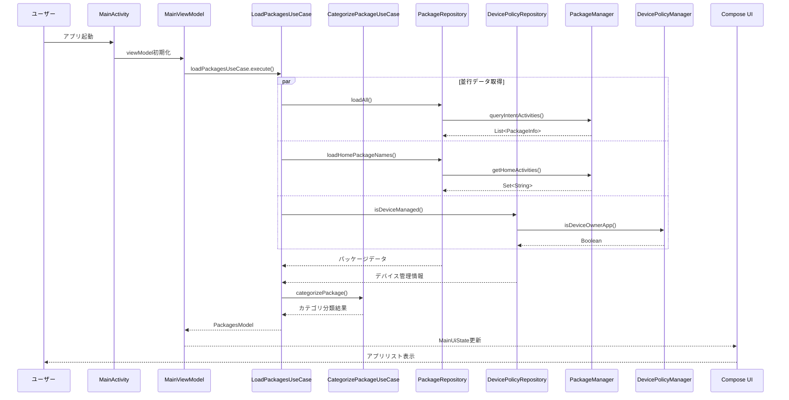

### データ変換フロー

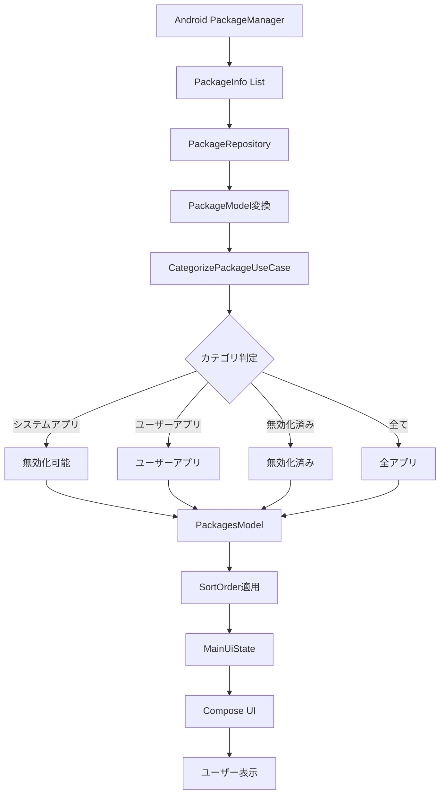

### 検索機能データフロー

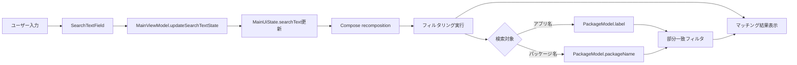

## 設定データフロー

### ユーザー設定の永続化フロー

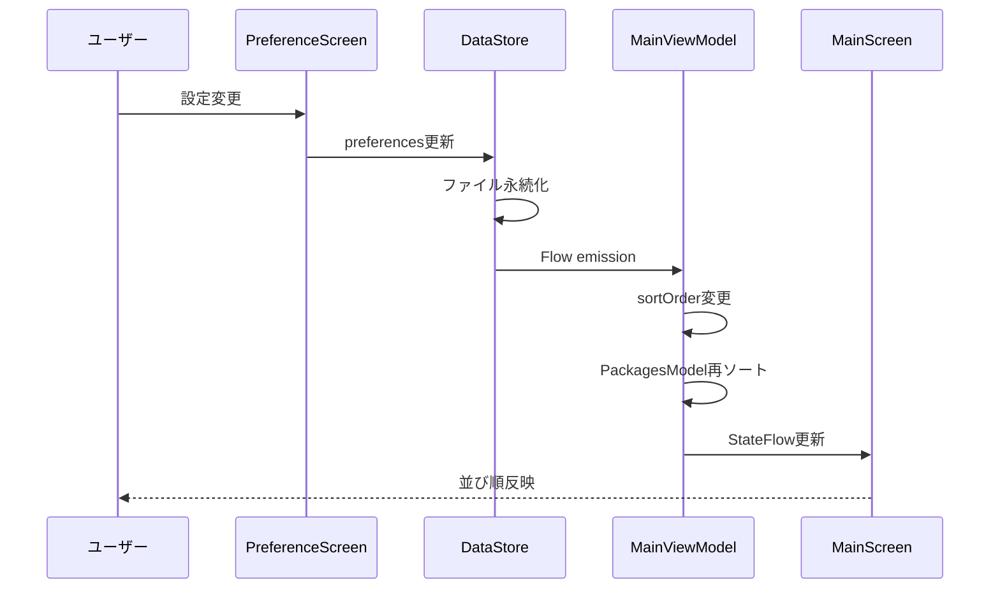

### ソート機能データフロー

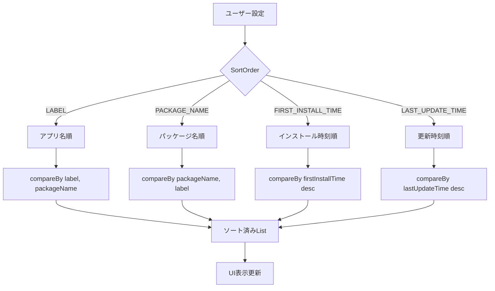

## 広告データフロー

### GDPR同意管理フロー

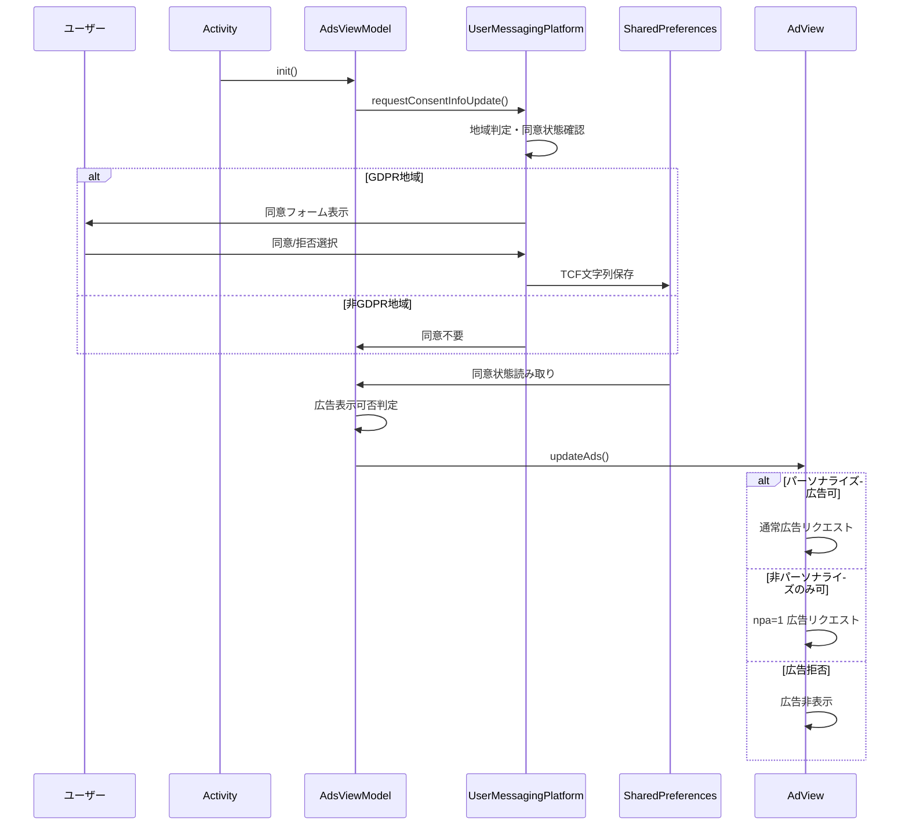

## エラーハンドリングフロー

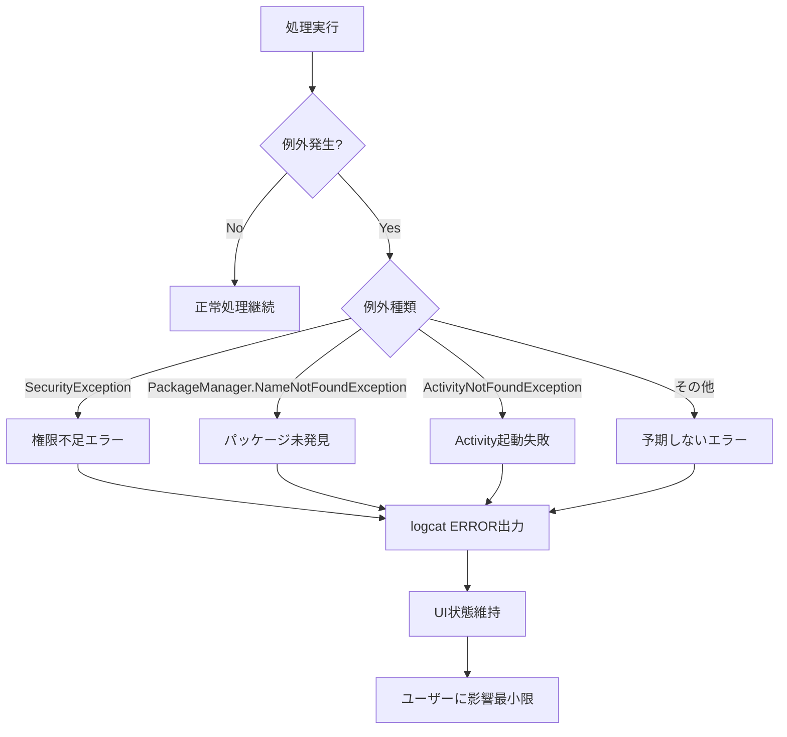

## 状態管理データフロー

### StateFlow ベース状態管理

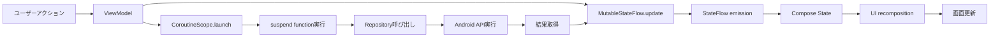

### 画面遷移データフロー

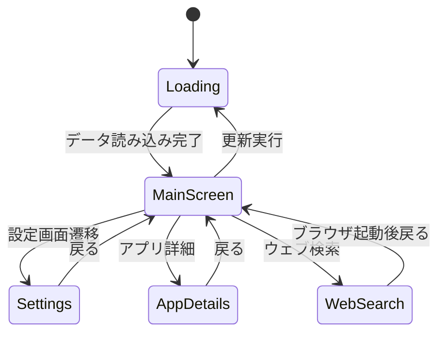

## データ永続化フロー

### DataStore Preferences

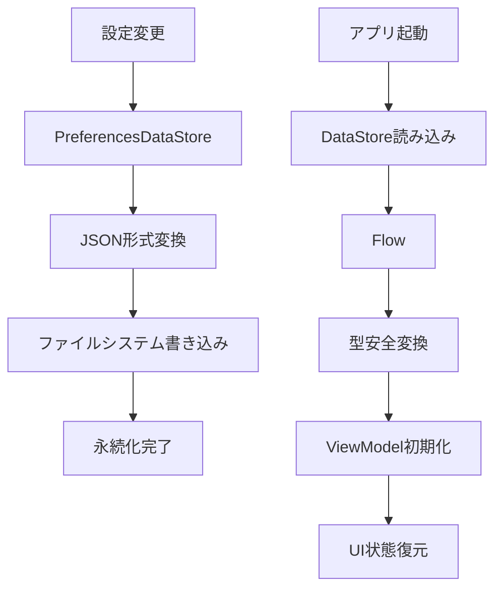

### メモリキャッシュフロー

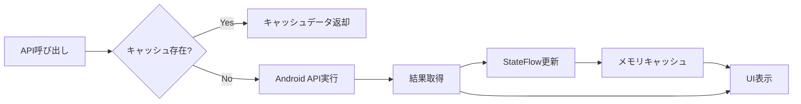

## パフォーマンス最適化フロー

### 非同期処理による最適化

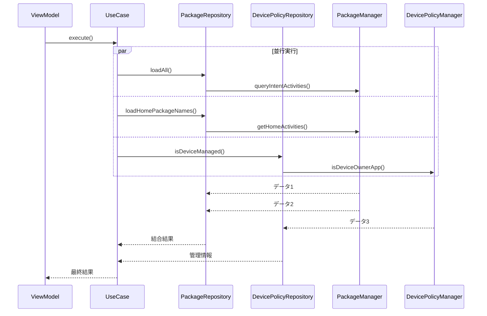

## リアクティブデータフロー

### Flow ベースのリアクティブプログラミング

```kotlin
// UserDataStore → ViewModel → UI
userDataStore.sortOrder
    .collect { newOrder ->
        _viewModelState.update { state ->
            state.copy(
                packagesModel = newOrder.sort(state.packagesModel),
                sortOrder = newOrder
            )
        }
    }
```

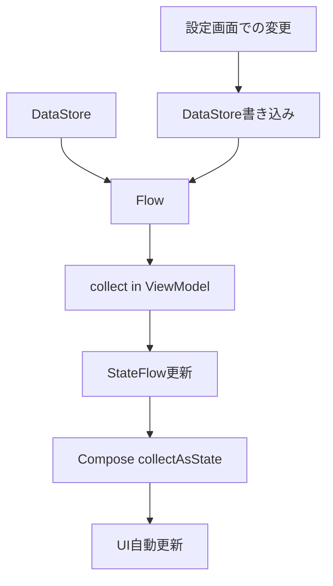

## 総括

Aplinのデータフローは以下の特徴を持っています：

1. **一方向データフロー**: UI → ViewModel → UseCase → Repository → Android API
2. **リアクティブ設計**: Flow/StateFlow による自動UI更新
3. **並行処理最適化**: async/await による効率的なデータ取得
4. **エラー分離**: 各層での適切な例外ハンドリング
5. **メモリ効率**: StateFlow による最小限の状態保持

この設計により、Android システムAPIの複雑さを抽象化し、ユーザーフレンドリーなアプリケーション管理体験を提供しています。