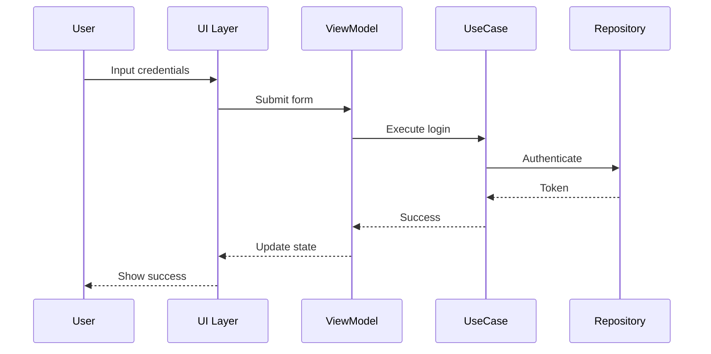
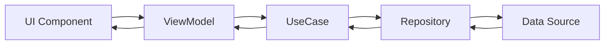
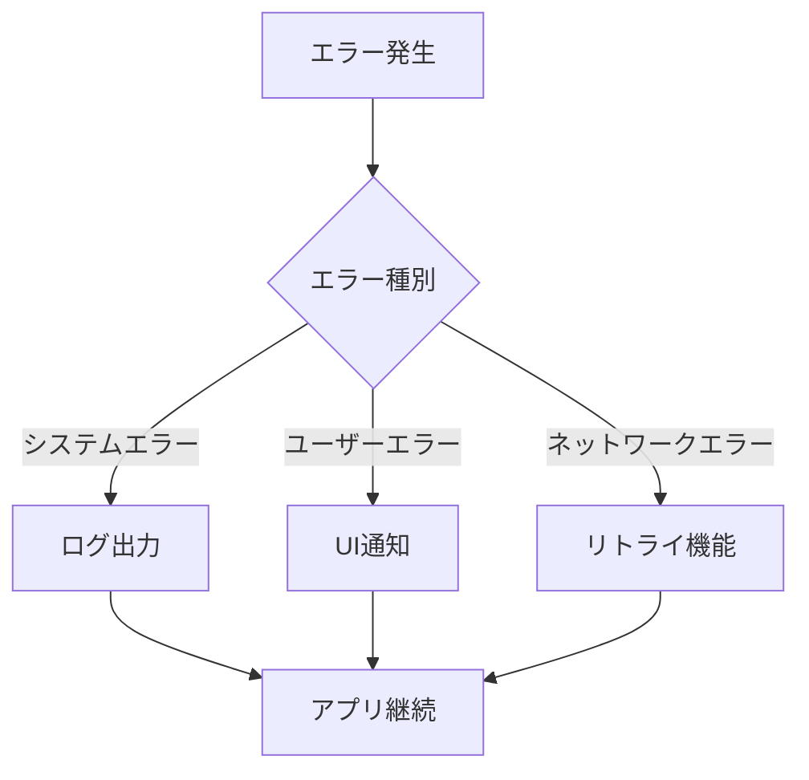

# データフロー図（逆生成）

## ユーザーインタラクションフロー

### Authentication Flow

## 状態管理フロー

### StateFlow + Compose
State flows from ViewModel to UI, events flow from UI to ViewModel

## エラーハンドリングフロー

### 戦略
- Try-catch blocks
- Result wrapper classes
- Error states in UI

### パターン
- Centralized error handling
- User-friendly error messages
- Retry mechanisms

