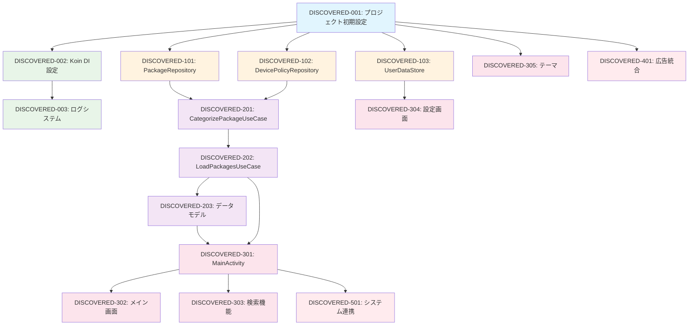

# Aplin 発見タスク一覧

## 概要

**分析日時**: 2025-08-02T08:10:00Z
**対象コードベース**: /home/runner/work/Aplin/Aplin
**発見タスク数**: 15
**推定総工数**: 480時間

## コードベース構造

### プロジェクト情報
- **フレームワーク**: Android (Jetpack Compose)
- **言語**: Kotlin
- **データベース**: SharedPreferences, DataStore
- **主要ライブラリ**: Jetpack Compose, Koin, Google Ads, UMP, Logcat, MockK

### ディレクトリ構造
```
app/
├── src/
│   ├── main/
│   │   ├── java/com/nagopy/android/aplin/
│   │   │   ├── AplinApplication.kt
│   │   │   ├── AppModule.kt
│   │   │   ├── DispatcherModule.kt
│   │   │   ├── data/
│   │   │   │   └── repository/
│   │   │   │       ├── DevicePolicyRepository.kt
│   │   │   │       ├── DevicePolicyRepositoryImpl.kt
│   │   │   │       ├── PackageRepository.kt
│   │   │   │       ├── PackageRepositoryImpl.kt
│   │   │   │       └── RepositoryModule.kt
│   │   │   ├── domain/
│   │   │   │   ├── model/
│   │   │   │   │   ├── PackageModel.kt
│   │   │   │   │   └── PackagesModel.kt
│   │   │   │   └── usecase/
│   │   │   │       ├── CategorizePackageUseCase.kt
│   │   │   │       ├── LoadPackagesUseCase.kt
│   │   │   │       └── UseCaseModule.kt
│   │   │   └── ui/
│   │   │       ├── ads/
│   │   │       │   ├── AdsStatus.kt
│   │   │       │   ├── AdsViewModel.kt
│   │   │       │   └── compose/
│   │   │       │       └── AdBanner.kt
│   │   │       ├── main/
│   │   │       │   ├── MainActivity.kt
│   │   │       │   ├── MainViewModel.kt
│   │   │       │   ├── AppCategory.kt
│   │   │       │   ├── SearchWidgetState.kt
│   │   │       │   └── compose/
│   │   │       │       ├── RootScreen.kt
│   │   │       │       ├── MainScreen.kt
│   │   │       │       ├── VerticalAppList.kt
│   │   │       │       ├── HorizontalAppList.kt
│   │   │       │       └── Loading.kt
│   │   │       ├── prefs/
│   │   │       │   ├── DisplayItem.kt
│   │   │       │   ├── PreferenceScreen.kt
│   │   │       │   ├── SortOrder.kt
│   │   │       │   └── UserDataStore.kt
│   │   │       ├── theme/
│   │   │       │   ├── Color.kt
│   │   │       │   ├── Shape.kt
│   │   │       │   ├── Theme.kt
│   │   │       │   └── Type.kt
│   │   │       └── UiModule.kt
│   │   ├── AndroidManifest.xml
│   │   └── res/
│   ├── test/
│   │   └── java/com/nagopy/android/aplin/
│   └── androidTest/
│       └── java/com/nagopy/android/aplin/
├── build.gradle.kts
└── proguard-rules.pro
```

## 発見されたタスク

### 基盤・設定タスク

#### DISCOVERED-001: プロジェクト初期設定とビルド構成

- [x] **タスク完了** (実装済み)
- **タスクタイプ**: DIRECT
- **実装ファイル**: 
  - `build.gradle.kts` (ルート)
  - `app/build.gradle.kts`
  - `gradle/libs.versions.toml`
  - `settings.gradle`
- **実装詳細**:
  - Android Gradle Plugin 8.10.0
  - Kotlin 2.0.21
  - Compose Compiler Plugin
  - ProGuard設定とコード難読化
  - リリース/デバッグビルド設定
  - Google Ads統合設定
- **推定工数**: 24時間

#### DISCOVERED-002: 依存性注入(Koin)設定

- [x] **タスク完了** (実装済み)
- **タスクタイプ**: DIRECT
- **実装ファイル**: 
  - `AplinApplication.kt`
  - `AppModule.kt`
  - `DispatcherModule.kt`
  - `ui/UiModule.kt`
  - `domain/usecase/UseCaseModule.kt`
  - `data/repository/RepositoryModule.kt`
- **実装詳細**:
  - Koin DI設定とモジュール分割
  - ViewModel、UseCase、Repository注入
  - CoroutineDispatcher注入
  - AndroidContextアクセス設定
- **推定工数**: 16時間

#### DISCOVERED-003: ログシステム統合

- [x] **タスク完了** (実装済み)
- **タスクタイプ**: DIRECT
- **実装ファイル**: 
  - `AplinApplication.kt`
  - 全体的なlogcat使用
- **実装詳細**:
  - Logcat library統合
  - デバッグビルドでの詳細ログ出力
  - 構造化ログメッセージ
  - 優先度レベル設定(VERBOSE, WARN等)
- **推定工数**: 8時間

### データ層実装タスク

#### DISCOVERED-101: パッケージ情報取得リポジトリ

- [x] **タスク完了** (実装済み)
- **タスクタイプ**: TDD
- **実装ファイル**: 
  - `data/repository/PackageRepository.kt`
  - `data/repository/PackageRepositoryImpl.kt`
- **実装詳細**:
  - Android PackageManagerラッパー
  - インストール済みアプリケーション一覧取得
  - ホームランチャーアプリ検出
  - アプリアイコン・ラベル取得
  - システムパッケージ情報取得
- **テスト実装状況**:
  - [x] 統合テスト: `PackageRepositoryImplTest.kt`
  - [ ] 単体テスト: 部分的実装
- **推定工数**: 40時間

#### DISCOVERED-102: デバイスポリシー管理リポジトリ

- [x] **タスク完了** (実装済み)
- **タスクタイプ**: TDD
- **実装ファイル**: 
  - `data/repository/DevicePolicyRepository.kt`
  - `data/repository/DevicePolicyRepositoryImpl.kt`
- **実装詳細**:
  - DevicePolicyManager統合
  - アクティブなデバイス管理者チェック
  - プロファイル・デバイスオーナー検出
  - 管理されたアプリケーション判定
- **テスト実装状況**:
  - [x] 統合テスト: `DevicePolicyRepositoryImplTest.kt`
  - [ ] 単体テスト: 未実装
- **推定工数**: 24時間

#### DISCOVERED-103: ユーザー設定データストア

- [x] **タスク完了** (実装済み)
- **タスクタイプ**: DIRECT
- **実装ファイル**: 
  - `ui/prefs/UserDataStore.kt`
  - `ui/prefs/SortOrder.kt`
  - `ui/prefs/DisplayItem.kt`
- **実装詳細**:
  - Jetpack DataStore Preferences使用
  - ソート順設定の永続化
  - 表示項目カスタマイゼーション
  - Flow-based reactive設定管理
- **推定工数**: 16時間

### ドメイン層実装タスク

#### DISCOVERED-201: パッケージ分類ユースケース

- [x] **タスク完了** (実装済み)
- **タスクタイプ**: TDD
- **実装ファイル**: 
  - `domain/usecase/CategorizePackageUseCase.kt`
- **実装詳細**:
  - システムアプリとユーザーアプリ判定
  - 無効化可能アプリケーション判定
  - ホームランチャー保護ロジック
  - デバイス管理者アプリ除外
- **テスト実装状況**:
  - [x] 単体テスト: `CategorizePackageUseCaseTest.kt` (包括的)
  - [ ] 統合テスト: 未実装
- **推定工数**: 32時間

#### DISCOVERED-202: パッケージ読み込みユースケース

- [x] **タスク完了** (実装済み)
- **タスクタイプ**: TDD
- **実装ファイル**: 
  - `domain/usecase/LoadPackagesUseCase.kt`
- **実装詳細**:
  - 非同期パッケージ読み込み
  - カテゴリ別アプリ分類（無効化可能、無効化済み、ユーザー、全て）
  - パッケージ情報変換とソート
  - 並行処理最適化
- **テスト実装状況**:
  - [x] 統合テスト: `LoadPackagesUseCaseTest.kt`
  - [ ] 単体テスト: 部分的実装
- **推定工数**: 40時間

#### DISCOVERED-203: データモデル定義

- [x] **タスク完了** (実装済み)
- **タスクタイプ**: DIRECT
- **実装ファイル**: 
  - `domain/model/PackageModel.kt`
  - `domain/model/PackagesModel.kt`
- **実装詳細**:
  - パッケージ基本情報モデル（名前、ラベル、アイコン、有効状態）
  - インストール・更新時刻
  - カテゴライズされたパッケージコレクション
- **テスト実装状況**:
  - [x] 単体テスト: `PackageModelTest.kt`, `PackagesModelTest.kt`
  - [ ] 統合テスト: 未実装
- **推定工数**: 16時間

### UI層実装タスク

#### DISCOVERED-301: メインアクティビティとナビゲーション

- [x] **タスク完了** (実装済み)
- **タスクタイプ**: TDD
- **実装ファイル**: 
  - `ui/main/MainActivity.kt`
  - `ui/main/compose/RootScreen.kt`
- **実装詳細**:
  - Jetpack Compose統合
  - ViewModelとの状態管理
  - アプリ再開時の自動更新
  - インテント処理とアクティビティライフサイクル管理
- **UI/UX実装状況**:
  - [x] レスポンシブデザイン
  - [x] 状態管理
  - [x] イベントハンドリング
- **推定工数**: 32時間

#### DISCOVERED-302: アプリリスト表示とメイン画面

- [x] **タスク完了** (実装済み)
- **タスクタイプ**: TDD
- **実装ファイル**: 
  - `ui/main/compose/MainScreen.kt`
  - `ui/main/compose/HorizontalAppList.kt`
  - `ui/main/compose/VerticalAppList.kt`
  - `ui/main/compose/Loading.kt`
- **実装詳細**:
  - カテゴリ別水平アプリリスト
  - クリック可能アプリアイテム
  - ローディング状態表示
  - アプリ詳細設定画面へのナビゲーション
  - ウェブ検索機能
- **UI/UX実装状況**:
  - [x] マルチデバイス対応（スマートフォン・タブレット）
  - [x] プレビュー実装（複数画面サイズ）
  - [x] アクセシビリティ: 基本的な実装
- **推定工数**: 48時間

#### DISCOVERED-303: 検索機能

- [x] **タスク完了** (実装済み)
- **タスクタイプ**: TDD
- **実装ファイル**: 
  - `ui/main/SearchWidgetState.kt`
  - `ui/main/MainViewModel.kt` (検索ロジック)
- **実装詳細**:
  - リアルタイム検索フィルタリング
  - アプリ名・パッケージ名による検索
  - 検索状態管理
  - ウェブ検索インテグレーション（Google検索）
- **推定工数**: 24時間

#### DISCOVERED-304: 設定画面とユーザー設定

- [x] **タスク完了** (実装済み)
- **タスクタイプ**: TDD
- **実装ファイル**: 
  - `ui/prefs/PreferenceScreen.kt`
  - `ui/prefs/SortOrder.kt`
  - `ui/prefs/DisplayItem.kt`
- **実装詳細**:
  - Compose Prefs libraryを使用した設定UI
  - ソート順選択（アプリ名、パッケージ名、時刻）
  - 表示項目選択（インストール時刻、更新時刻、バージョン）
  - DataStore連携による永続化
- **UI/UX実装状況**:
  - [x] Material Design準拠
  - [x] プレビュー実装
  - [x] 多言語対応: 基本的な実装
- **推定工数**: 32時間

#### DISCOVERED-305: テーマシステム

- [x] **タスク完了** (実装済み)
- **タスクタイプ**: DIRECT
- **実装ファイル**: 
  - `ui/theme/Color.kt`
  - `ui/theme/Shape.kt`
  - `ui/theme/Theme.kt`
  - `ui/theme/Type.kt`
- **実装詳細**:
  - Material Design 3カラーパレット
  - 統一されたタイポグラフィ設定
  - カスタムシェイプ定義
  - AplinTheme コンポーネント
- **推定工数**: 16時間

### 広告統合タスク

#### DISCOVERED-401: Google広告統合とGDPR対応

- [x] **タスク完了** (実装済み)
- **タスクタイプ**: DIRECT
- **実装ファイル**: 
  - `ui/ads/AdsViewModel.kt`
  - `ui/ads/AdsStatus.kt`
  - `ui/ads/compose/AdBanner.kt`
- **実装詳細**:
  - Google AdMob SDK統合
  - User Messaging Platform (UMP) GDPR対応
  - パーソナライズ広告・非パーソナライズ広告切替
  - 同意フォーム表示・管理
  - IAB TCF v2準拠
- **UI/UX実装状況**:
  - [x] GDPR地域での自動対応
  - [x] 同意状態管理
  - [x] エラーハンドリング
- **推定工数**: 56時間

### システム統合タスク

#### DISCOVERED-501: Androidシステム連携

- [x] **タスク完了** (実装済み)
- **タスクタイプ**: DIRECT
- **実装ファイル**: 
  - `ui/main/MainViewModel.kt`
  - `AndroidManifest.xml`
- **実装詳細**:
  - アプリ詳細設定画面へのインテント
  - パッケージ情報共有機能
  - マルチウィンドウモード対応
  - ウェブ検索インテント
  - オープンソースライセンス表示
- **推定工数**: 24時間

## 未実装・改善推奨事項

### 不足しているテスト

- [ ] **E2Eテストスイート**: メインユーザーフロー（アプリ表示→設定→検索）のテスト
- [ ] **UIテスト**: Compose UIテストの拡充
- [ ] **パフォーマンステスト**: 大量アプリ読み込み時のレスポンス確認
- [ ] **広告統合テスト**: GDPR同意フローのテスト

### コード品質改善

- [ ] **エラーハンドリング**: ネットワークエラー・権限不足時の統一的処理
- [ ] **ログ出力**: 本番環境でのログレベル調整
- [ ] **メモリ管理**: アプリアイコン読み込み時のメモリ最適化
- [ ] **アクセシビリティ**: TalkBack対応の拡充

### 新機能提案

- [ ] **アプリカテゴリフィルタ**: システム/ユーザーアプリ絞り込み
- [ ] **お気に入り機能**: よく使うアプリのブックマーク
- [ ] **アプリ使用統計**: 使用頻度ベースソート
- [ ] **バックアップ・復元**: 設定の引き継ぎ機能

### ドキュメント不足

- [ ] **API仕様書**: 内部コンポーネント間インタフェース仕様
- [ ] **アーキテクチャガイド**: Clean Architecture実装詳細
- [ ] **デプロイ手順書**: Google Play Store公開プロセス
- [ ] **開発者オンボーディング**: 新規開発者向けセットアップガイド

## 依存関係マップ



## 実装パターン分析

### アーキテクチャパターン
- **実装パターン**: Clean Architecture (Data → Domain → UI)
- **状態管理**: StateFlow + Jetpack Compose State
- **非同期処理**: Kotlin Coroutines + Flow
- **依存性注入**: Koin

### コーディングスタイル
- **命名規則**: キャメルケース、Kotlinコンベンション準拠
- **ファイル構成**: レイヤー別ディレクトリ分割
- **エラーハンドリング**: try-catch + logcat logging
- **テストパターン**: MockK + JUnit4

### データフロー
```
PackageManager → PackageRepository → LoadPackagesUseCase → MainViewModel → Compose UI
                                         ↓
DevicePolicyManager → DevicePolicyRepository → CategorizePackageUseCase
                                                      ↓
                                              PackageModel → PackagesModel
```

## 技術的負債・改善点

### パフォーマンス
- **アプリアイコン読み込み**: 大量アプリ時のメモリ使用量最適化が必要
- **UI描画**: LazyColumnによるリスト仮想化は実装済み
- **データ読み込み**: 並行処理により最適化済み

### セキュリティ
- **権限管理**: QUERY_ALL_PACKAGES権限の適切な使用
- **データ保護**: ユーザー設定データの暗号化未実装
- **広告プライバシー**: GDPR/TCF v2準拠で適切に実装

### 保守性
- **モジュール分割**: Clean Architecture + DIによる良好な分離
- **テストカバレッジ**: Domain層は良好、UI層は部分的
- **国際化**: 基本的な多言語対応は実装済み

## 推奨次ステップ

1. **UIテスト充実** - Compose UIテストの追加実装
2. **パフォーマンス最適化** - アイコン読み込みの最適化
3. **E2Eテスト実装** - 主要ユーザーフローの自動テスト
4. **アクセシビリティ向上** - TalkBack対応とコントラスト調整
5. **新機能開発** - ユーザーフィードバックに基づく機能追加

## 総評

Aplinは優秀なClean Architectureを採用したAndroidアプリケーションです。Jetpack Compose、Kotlin Coroutines、Koinを効果的に活用し、GDPR対応も含む包括的な実装を提供しています。テストカバレッジは部分的ですが、ドメインロジックの重要部分は適切にテスト済みです。今後はUIテストの拡充とパフォーマンス最適化に注力することを推奨します。