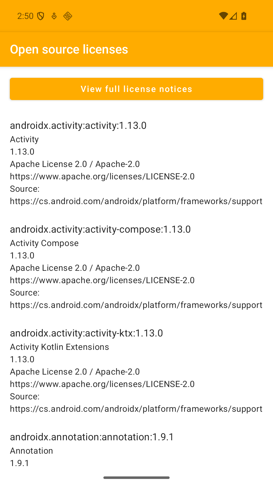
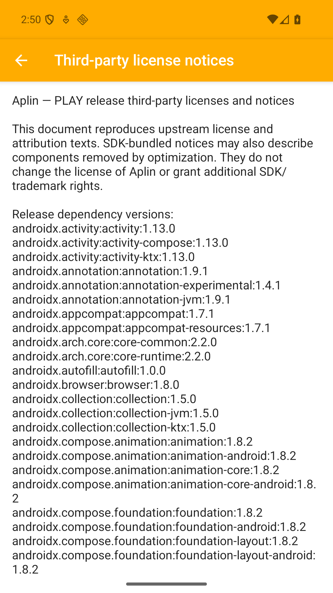
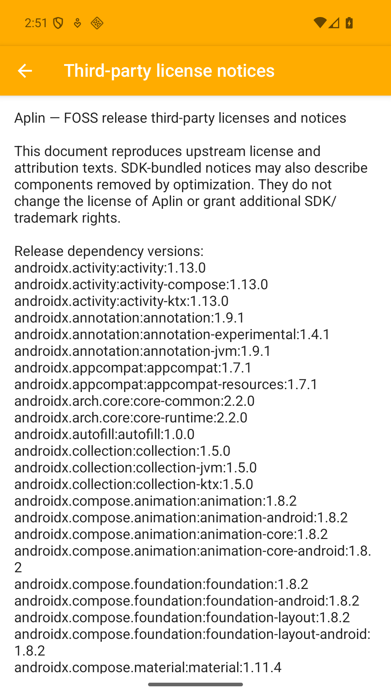

# Third-party notices screen captures

These unedited emulator screenshots accompany PR #360. `LicenseNoticesScreenTest`
captures the dependency catalog and the beginning of the bundled full notices for
each distribution. The test also checks the distribution-specific asset header,
opens the full text, scrolls it, and returns to the catalog with system back.

Environment: Android API 36, `sdk_gphone64_arm64`, English, debug builds.
Play uses `-PallowTestAds=true` and application ID
`com.nagopy.android.aplin.ci.debug`; FOSS uses
`com.nagopy.android.aplin.foss.debug`.

Validation on 2026-09-06: all nine existing instrumentation tests completed for
each variant, and the new license screen test passed separately for each variant
(10 distinct tests per variant). The initial screen test incorrectly asserted
the return value of `UiObject2.scroll`; after correcting it to compare the actual
content region, both screen test reruns passed. The four images below are from
those successful reruns.

| Screen | Play | FOSS |
| --- | --- | --- |
| Dependency catalog |  |  |
| Full notices |  |  |

Build the app and instrumentation APKs with:

```sh
./gradlew -PallowTestAds=true assemblePlayDebug assembleFossDebug \
  assemblePlayDebugAndroidTest assembleFossDebugAndroidTest
```

After installing a variant and its test APK, run its complete instrumentation
suite with:

```sh
adb shell am instrument -w -r \
  <applicationId>.test/androidx.test.runner.AndroidJUnitRunner
```

The screen test
writes `license-catalog.png` and `license-notices.png` under the target app's
external files directory in `pr360/`.

The existing `LoadPackagesUseCaseTest` logs missing Settings labels or unavailable
disable buttons without failing an assertion. Its passing status therefore does
not prove every installed app's classification is correct. These captures also
do not verify production ad configuration, signing, or behavior on other Android
versions.

Both runs logged the same 11 missing labels (Bluetooth, Health Connect, NFC Migration,
NFC Service, Photos & videos, RemoteProvisioner, System UWB Resources, AppSearch,
Federated Compute, Health Connect backup/restore, and DeviceConfig resources)
and one missing disable button (`com.android.virtualmachine.res`). These cases
remain unverified by that observational test.
