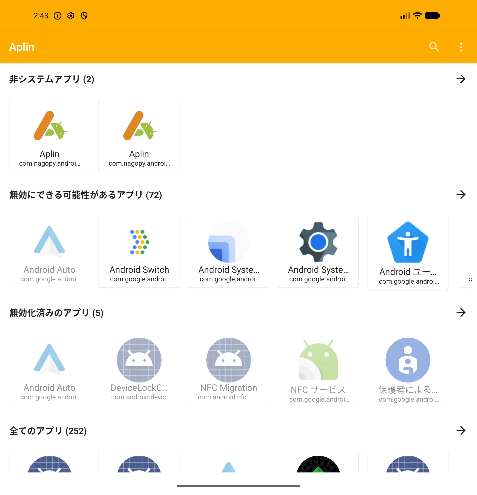
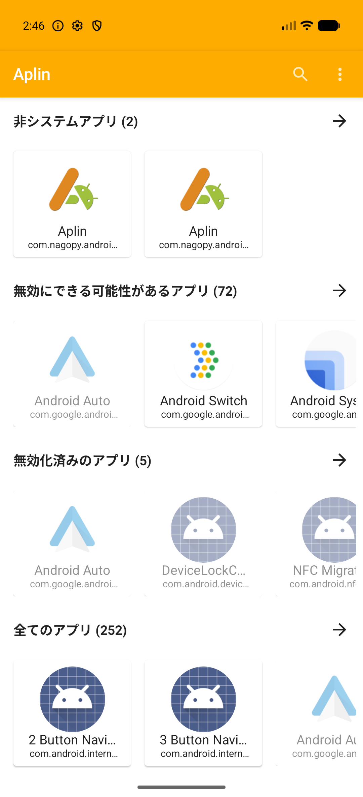
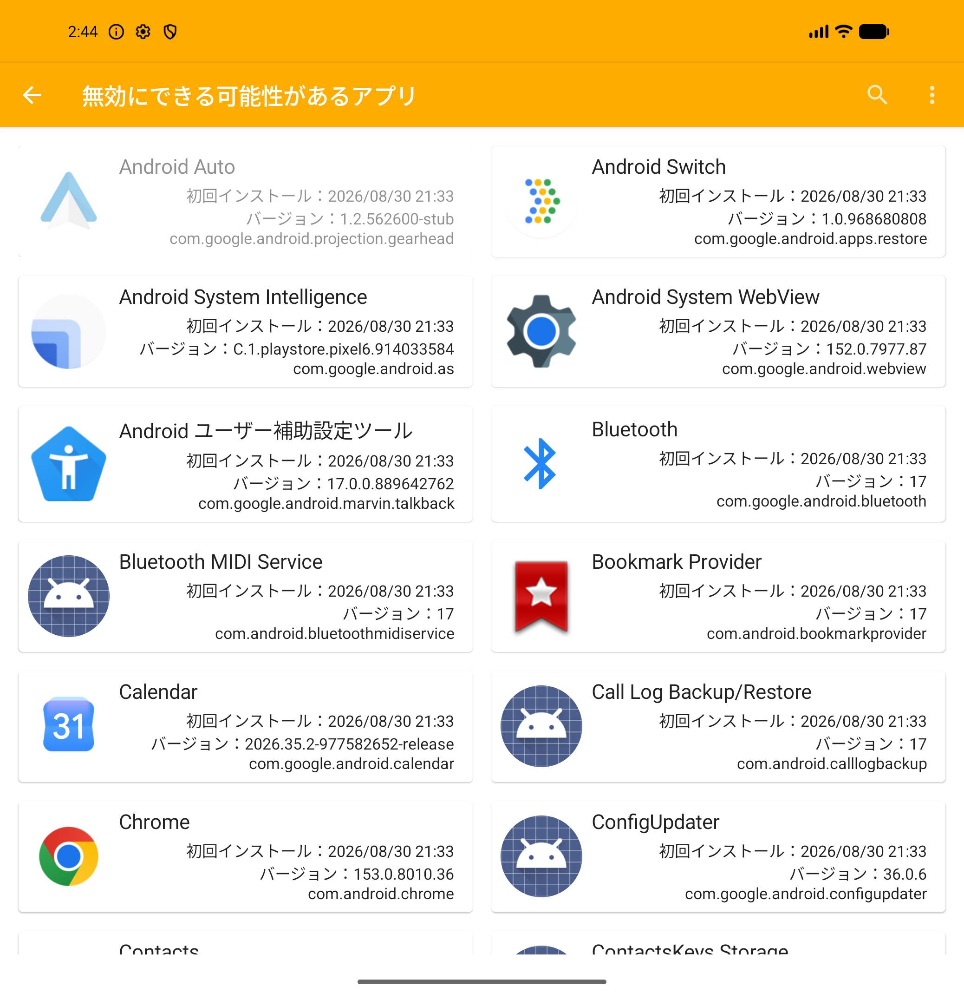
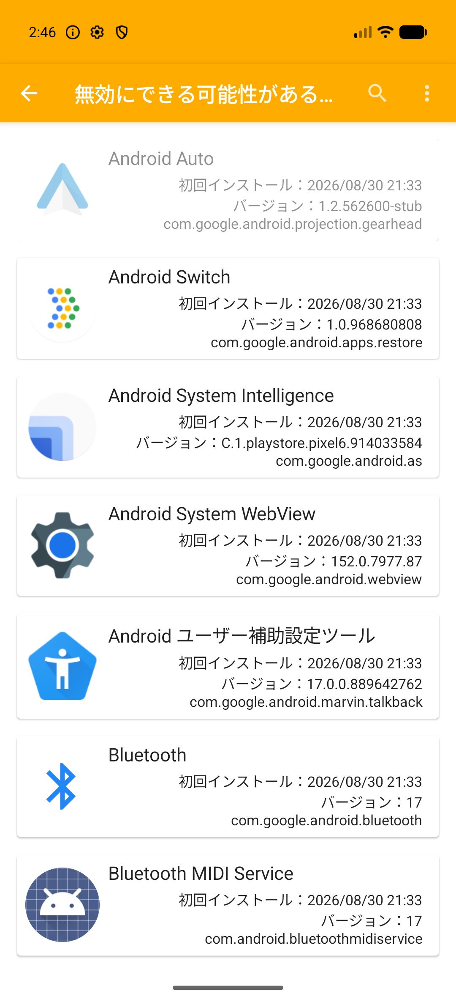
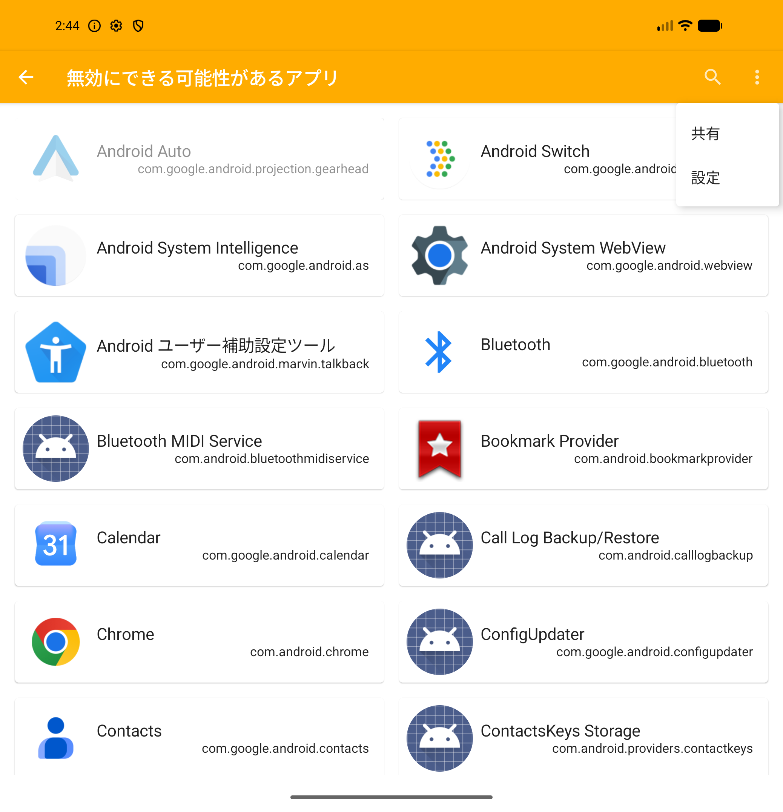

# Wide-screen layout captures

These unedited emulator screenshots accompany PR #361.

Environment: Android API 37, `sdk_gphone16k_arm64` (Pixel 10 Pro Fold AVD),
Japanese locale, FOSS debug build (`com.nagopy.android.aplin.foss.debug`).
The inner display is 2076×2152 px at 390 dpi (~852×883dp); the outer display is
1080×2364 px at 390 dpi (~443dp wide). The list captures have "first install
time" and "version name" enabled in Preferences.

| Screen | Inner display (~852dp) | Outer display (~443dp) |
| --- | --- | --- |
| Home |  |  |
| Category list |  |  |
| Overflow menu |  | |

Checked manually on 2026-09-24:

- Home shows five cards per row on the inner display and keeps the phone
  sizing on the outer display.
- The category list uses two columns on the inner display and one column on
  the outer display; cards in the same row have the same height.
- Search stays a visible app bar action. Tapping it focuses the search field
  and shows the soft keyboard. The overflow menu contains Share and
  Preferences on list screens.
- Long titles are ellipsized on the outer display.
- Tapping a card opens the system App info screen. Folding and unfolding
  switches between the one- and two-column list.
